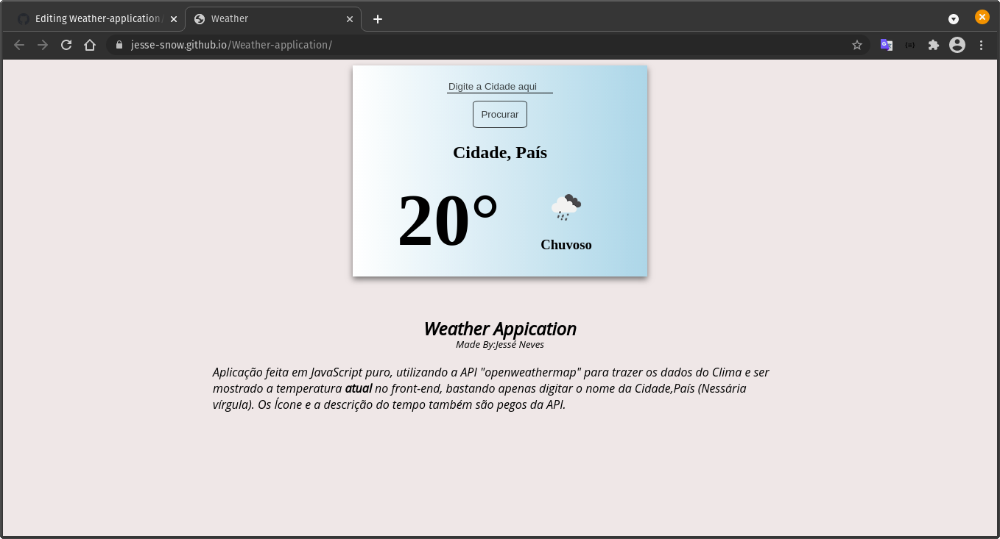

# Current Weather App

This App show the current weather based of user Input. The data is showed from [Openweathermap APi](https://openweathermap.org/current).

## Table of contents

- [Overview](#overview)
  - [The challenge](#the-challenge)
  - [Screenshot](#screenshot)
  - [Links](#links)
- [My process](#my-process)
  - [Built with](#built-with)
  - [What I learned](#what-i-learned)
  - [Continued development](#continued-development)
- [Author](#author)

## Overview

### The challenge

- Take the weather data from some Api

### Screenshot

### Links

- [Preview Solution](https://jesse-snow.github.io/Weather-application/)

## My process

### Built with

- HTML5
- CSS3
- [Openweathermap APi](https://openweathermap.org/current)

### What I learned

How to connect an app with some APi. In this case i use fetch.

### Continued development

I want to make the Hour change based of the location.

## Author

GitHub - [@Jesse-Snow](https://github.com/Jesse-Snow)
